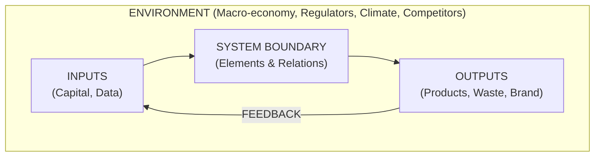

2026-07-29 19:34

Tags:

# Anatomy of a System Boundary

- **Inputs:** Resources, information, or demands entering the system (e.g., raw materials, capital, customer orders).
    
- **Boundary:** The conceptual line defining what is analyzed versus what is excluded.
    
- **Elements & Relationships:** The internal components and how they interact.
    
- **Outputs:** The direct results of the system's function (e.g., finished goods, emissions, market reputation).
    
- **Environment:** External forces the system interacts with but cannot control (e.g., regulatory shifts, labor markets).
    
- **Feedback:** Output data fed back into the system to correct or alter future behavior.

