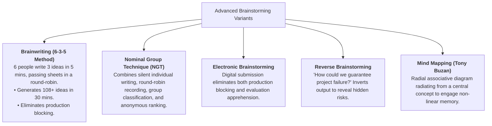

2026-07-28 14:05

Tags:

# Brainstorming & Advanced Variants

- **Origin & Rules (Alex Osborn):** Built on four rules: _Defer judgment, encourage wild ideas, aim for quantity over quality, and build on others' ideas ("Yes, and...")_.
    
- **The "Nominal Group" Research Finding:** Traditional verbal brainstorming groups often produce _fewer_ and _lower-quality_ ideas than individuals working alone due to three psychological traps:
    
    1. **Production Blocking:** Only one person can speak at a time; others forget or drop ideas while waiting.
        
    2. **Evaluation Apprehension:** Fear of peer judgment suppresses unconventional ideas.
        
    3. **Social Loafing:** Individuals reduce cognitive effort inside a group setting.

