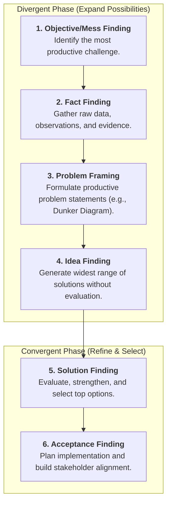

2026-07-28 13:59

Tags:

# CPS Cycle

```mermaid
graph TD
    subgraph Divergent ["Divergent Phase (Expand Possibilities)"]
        S1["<b>1. Objective/Mess Finding</b><br>Identify the most productive challenge."] --> S2["<b>2. Fact Finding</b><br>Gather raw data, observations, and evidence."]
        S2 --> S3["<b>3. Problem Framing</b><br>Formulate productive problem statements (e.g., Dunker Diagram)."]
        S3 --> S4["<b>4. Idea Finding</b><br>Generate widest range of solutions without evaluation."]
    end

    subgraph Convergent ["Convergent Phase (Refine & Select)"]
        S4 --> S5["<b>5. Solution Finding</b><br>Evaluate, strengthen, and select top options."]
        S5 --> S6["<b>6. Acceptance Finding</b><br>Plan implementation and build stakeholder alignment."]
    end
```