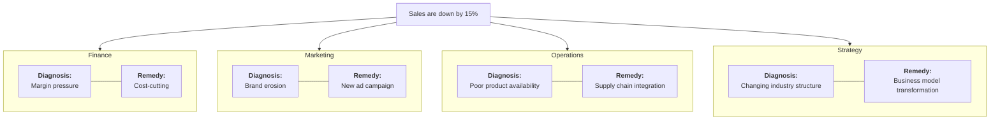

2026-07-23 15:06

Tags:

# Case Study: Functional Framing on Declining Sales

The single data point—**"Sales are declining by 15%"**—triggers completely different interpretations and interventions based on functional frames:

