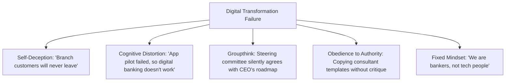

2026-07-23 16:33

Tags:

# Case Study - Multi-Level Failure in Bank Digital Transformation

When multiple enemies operate simultaneously, they create compound organizational failure:

```mermaid
graph TD
    A["Digital Transformation Failure"] --> B["Self-Deception: 'Branch customers will never leave'"]
    A --> C["Cognitive Distortion: 'App pilot failed, so digital banking doesn't work'"]
    A --> D["Groupthink: Steering committee silently agrees with CEO's roadmap"]
    A --> E["Obedience to Authority: Copying consultant templates without critique"]
    A --> F["Fixed Mindset: 'We are bankers, not tech people'"]
```