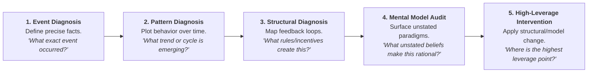

2026-07-31 12:31

Tags:

# Diagnostic Protocol Across the Iceberg

To perform a systemic diagnosis on any organizational challenge, work down through these diagnostic questions:

- **Event Level:** Describe what occurred with factual precision (_Who, what, where, when, and magnitude_) without attributing premature blame.
    
- **Pattern Level:** Plot key variables across time series. Ask: _Is this getting better or worse? At what rate is it changing? When did the structural shift begin?_
    
- **Systemic Structure Level:** Map the underlying causal architecture. Audit feedback loops ($R$ and $B$), time delays, information bottlenecks, and incentive metrics.
    
- **Mental Model Level:** Surface the tacit worldviews held by leadership. Ask: _What assumptions must be accepted as true for this flawed structure to seem reasonable?_
    
- **Leverage Assessment:** Identify where to intervene. Changing surface events offers the lowest leverage; altering mental models offers the highest leverage.