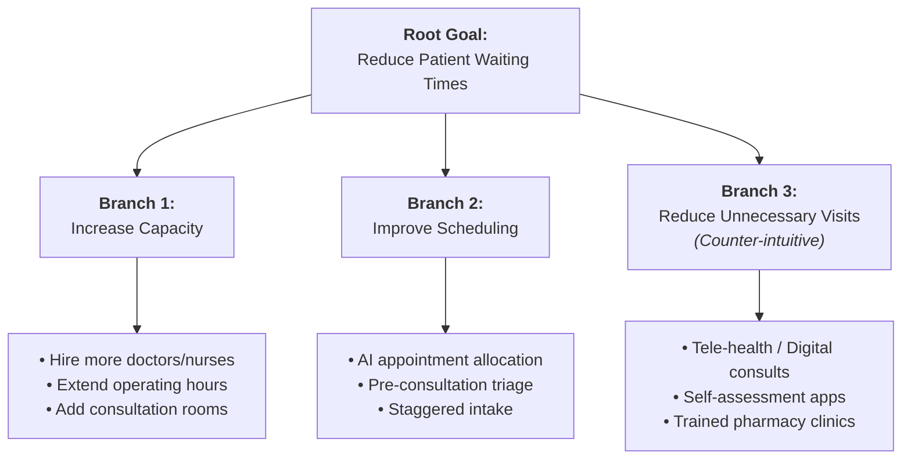

2026-07-28 14:01

Tags:

# Dunker Diagram

- **Origin & Concept:** Proposed by cognitive psychologist Karl Dunker. Uses **functional analysis** to map a problem as a hierarchical tree, moving from a general functional goal down through distinct solution directions to concrete leaf nodes.
    
- **Core Function:** Directly combats **functional fixedness** (the tendency to view objects, departments, or processes as having only one fixed function) and prevents premature convergence on a single remedy.

