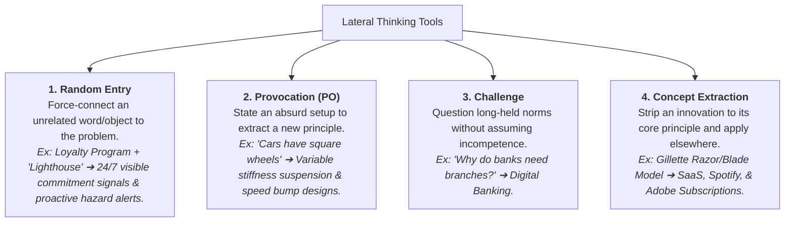

2026-07-28 14:04

Tags:

# Edward de Bono’s Lateral Thinking

- **Concept:** Grounded in the insight that the brain is a self-organizing pattern-recognition system that gets trapped in self-reinforcing logical routines (_vertical thinking_). Lateral thinking provides formal tools to deliberately disrupt these patterns.

