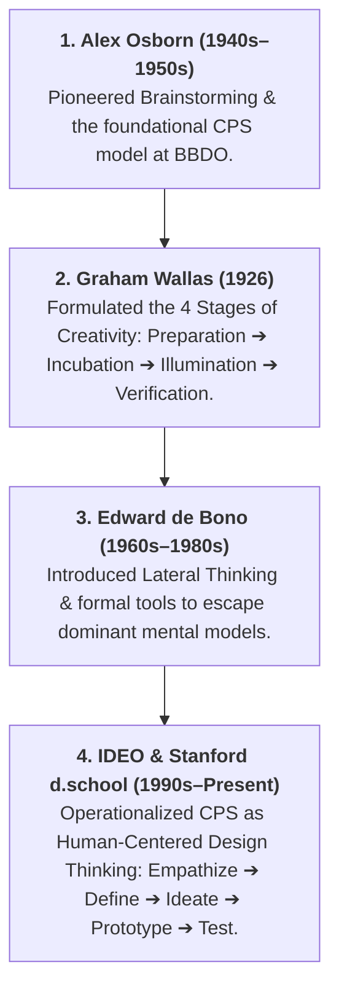

2026-07-28 13:59

Tags:

# Evolution of CPS

```mermaid
graph TD
    A["<b>1. Alex Osborn (1940s–1950s)</b><br>Pioneered Brainstorming & the foundational CPS model at BBDO."] --> B["<b>2. Graham Wallas (1926)</b><br>Formulated the 4 Stages of Creativity: Preparation ➔ Incubation ➔ Illumination ➔ Verification."]
    B --> C["<b>3. Edward de Bono (1960s–1980s)</b><br>Introduced Lateral Thinking & formal tools to escape dominant mental models."]
    C --> D["<b>4. IDEO & Stanford d.school (1990s–Present)</b><br>Operationalized CPS as Human-Centered Design Thinking: Empathize ➔ Define ➔ Ideate ➔ Prototype ➔ Test."]
```