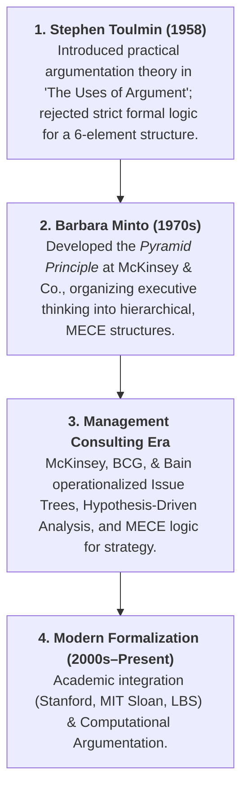

2026-07-25 14:29

Tags:

# Evolution of SCR

```mermaid
graph TD
    A["<b>1. Stephen Toulmin (1958)</b><br>Introduced practical argumentation theory in 'The Uses of Argument'; rejected strict formal logic for a 6-element structure."] --> B["<b>2. Barbara Minto (1970s)</b><br>Developed the <i>Pyramid Principle</i> at McKinsey & Co., organizing executive thinking into hierarchical, MECE structures."]
    B --> C["<b>3. Management Consulting Era</b><br>McKinsey, BCG, & Bain operationalized Issue Trees, Hypothesis-Driven Analysis, and MECE logic for strategy."]
    C --> D["<b>4. Modern Formalization (2000s–Present)</b><br>Academic integration (Stanford, MIT Sloan, LBS) & Computational Argumentation."]
```