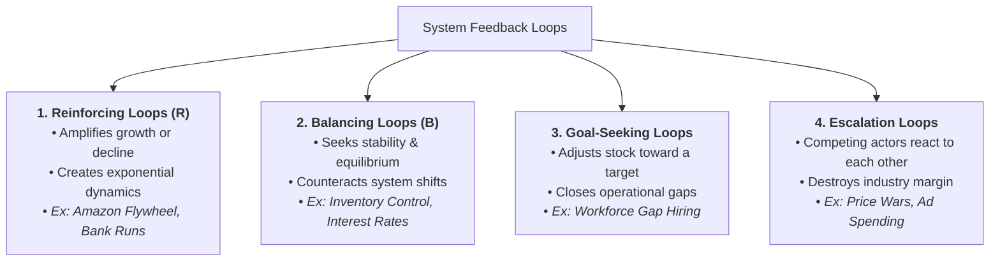

2026-07-29 19:43

Tags:

# Feedback Loop

Feedback occurs when a change in a stock alters the inflows or outflows affecting that same stock. Feedback loops serve as the internal engines driving system behavior.

