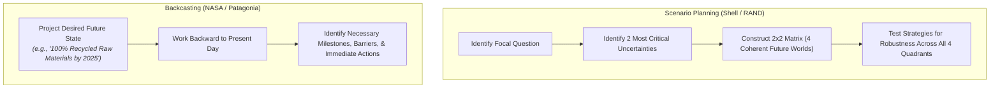

2026-07-28 14:07

Tags:

# Futuring & Backcasting

A family of long-horizon methods designed to escape current constraints by examining future states. Used when decisions involve high lead times, irreversible capital commitments, or external turbulence

