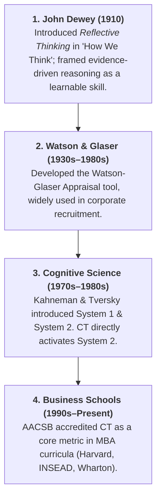

2026-07-24 07:36

Tags:

# Intellectual Evolution of Critical Thinking

```mermaid
graph TD
    A["<b>1. John Dewey (1910)</b><br>Introduced <i>Reflective Thinking</i> in 'How We Think'; framed evidence-driven reasoning as a learnable skill."] --> B["<b>2. Watson & Glaser (1930s–1980s)</b><br>Developed the Watson-Glaser Appraisal tool, widely used in corporate recruitment."]
    B --> C["<b>3. Cognitive Science (1970s–1980s)</b><br>Kahneman & Tversky introduced System 1 & System 2. CT directly activates System 2."]
    C --> D["<b>4. Business Schools (1990s–Present)</b><br>AACSB accredited CT as a core metric in MBA curricula (Harvard, INSEAD, Wharton)."]
```