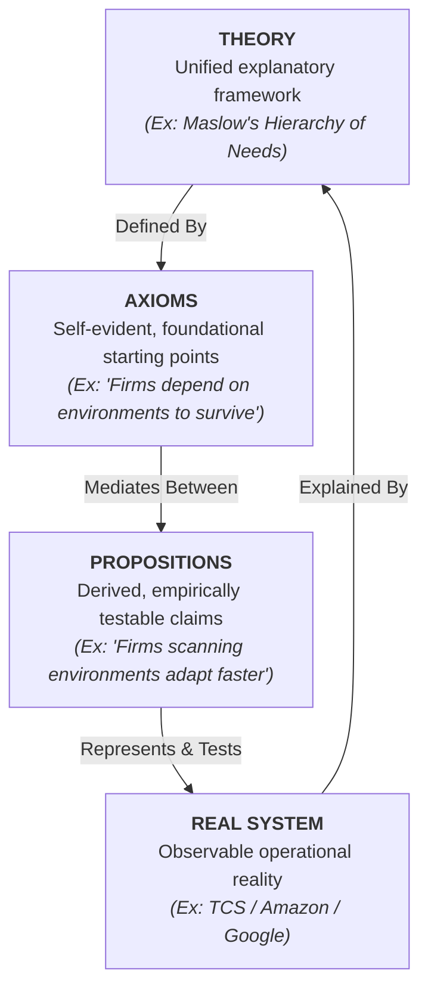

2026-08-01 08:48

Tags:

# Interplay - Theory, Axiom, Proposition

```mermaid
graph TD
    Theory["<b>THEORY</b><br>Unified explanatory framework<br><i>(Ex: Maslow's Hierarchy of Needs)</i>"] -->|Defined By| Axioms["<b>AXIOMS</b><br>Self-evident, foundational starting points<br><i>(Ex: 'Firms depend on environments to survive')</i>"]
    Axioms -->|Mediates Between| Propositions["<b>PROPOSITIONS</b><br>Derived, empirically testable claims<br><i>(Ex: 'Firms scanning environments adapt faster')</i>"]
    Propositions -->|Represents & Tests| RealSystem["<b>REAL SYSTEM</b><br>Observable operational reality<br><i>(Ex: TCS / Amazon / Google)</i>"]
    RealSystem -->|Explained By| Theory
```

