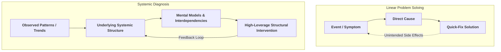

2026-07-30 13:20

Tags:

# Linear Problem Solving vs. Systemic Diagnosis

Conventional management often relies on **linear problem solving**—assuming direct, immediate, and proportional cause-and-effect relationships. 

**Systems thinking** shifts focus to underlying structures, feedback loops, interdependencies, and delays that produce repeating patterns over time.

