2026-07-24 07:40

Tags:

# Paul-Elder Critical Thinking Framework

To translate managerial thinking into observable elements, apply Paul & Elder's dual framework of **Elements of Thought** and **Intellectual Standards**:

```mermaid
graph LR
    subgraph Elements ["Elements of Thought"]
        E1["Purpose"]
        E2["Question at Issue"]
        E3["Information"]
        E4["Concepts"]
        E5["Assumptions"]
        E6["Inferences"]
        E7["Implications"]
        E8["Point of View"]
    end

    subgraph Standards ["Intellectual Standards"]
        S1["Clarity"]
        S2["Accuracy"]
        S3["Precision"]
        S4["Relevance"]
        S5["Depth"]
        S6["Breadth"]
        S7["Logic"]
        S8["Fairness"]
    end

    Elements -->|Evaluated By| Standards
```

## The Elements of Thought (8 Structural Components)

Whenever we think about a problem, we engage in eight distinct mental activities. Weak reasoning usually stems from neglecting one or more of these elements.

- **Purpose:** What is the primary goal or objective? _(What am I trying to accomplish?)_
    
- **Question at Issue:** What specific problem, topic, or choice is being addressed?
    
- **Information:** What facts, data, evidence, or experiences are being relied upon?
    
- **Interpretation & Inference:** What conclusions or solutions are drawn from the data?
    
- **Concepts:** What theoretical models, definitions, principles, or frameworks shape the logic?
    
- **Assumptions:** What unstated premises or underlying beliefs are taken for granted?
    
- **Implications & Consequences:** What automatically follows if this line of thinking is acted upon?
    
- **Point of View:** From what perspective, bias, or lens is the problem being examined?

## Universal Intellectual Standards (Evaluating the Elements)

To determine whether the reasoning is sound, the **Standards** must be applied to the **Elements**.

- **Clarity:** Can the idea be elaborated, illustrated, or expressed cleanly without ambiguous jargon?
    
- **Accuracy:** Is the information factually true and verified?
    
- **Precision:** Is the claim specific and detailed enough to be actionable? _(e.g., "sales dropped 12%" vs. "sales dropped a lot")_.
    
- **Relevance:** How does this specific point directly connect to the core question at issue?
    
- **Depth:** Does the reasoning address the underlying complexities and constraints, or is it superficial?
    
- **Breadth:** Have alternative viewpoints, counter-arguments, and edge cases been evaluated?
    
- **Logic:** Do the conclusions follow coherently from the evidence without contradiction?
    
- **Significance:** Is this the most critical issue to focus on, or a non-trivial distraction?
    
- **Fairness:** Is the argument balanced, or is it distorted by personal bias, ego, or vested interests?

