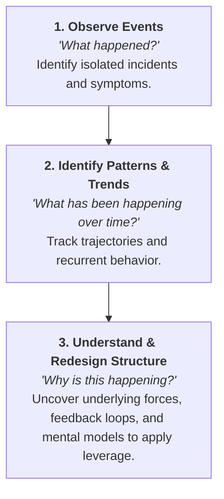
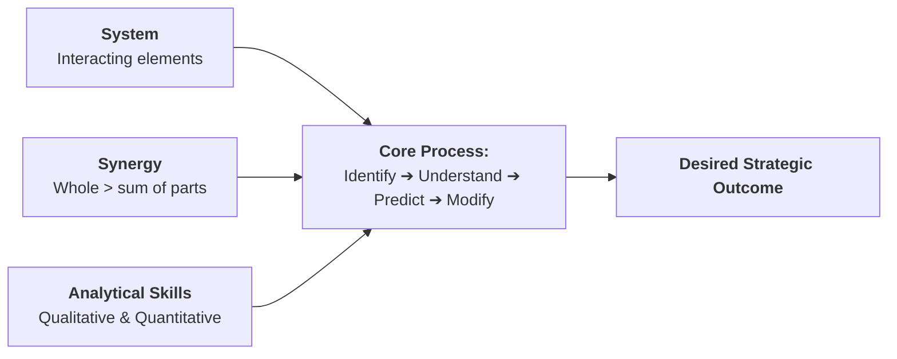

2026-07-30 14:52

Tags:

# Process of Systemic Intervention

> **Systems Thinking** is a set of synergistic analytical skills used to improve the capability of identifying and understanding systems, predicting their behaviors, and devising modifications to them in order to produce desired effects.

