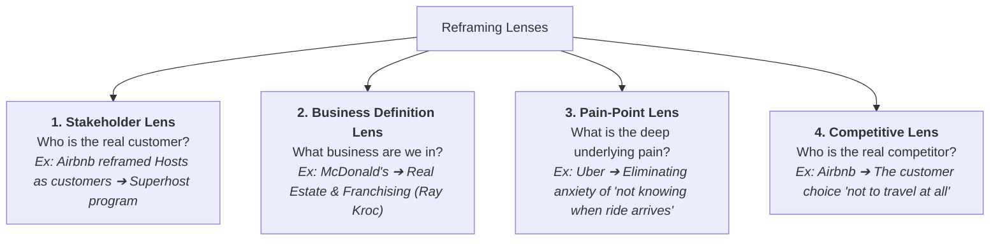

2026-07-28 14:03

Tags:

# Reframing

- **Origin & Concept:** Formulated by Watzlawick, Weakland, and Fisch; systematized in management by IDEO, Stanford d.school, and Harvard Business School.
    
- **Reframing vs. Restatement:** Statement/Restatement alters the _language_ of a problem; Reframing alters the underlying _mental model_ and conceptual framework governing the problem.

