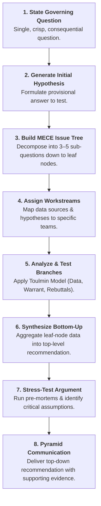

2026-07-28 13:42

Tags:

# SCR Execution Process

```mermaid
graph TD
    S1["<b>1. State Governing Question</b><br>Single, crisp, consequential question."] --> S2["<b>2. Generate Initial Hypothesis</b><br>Formulate provisional answer to test."]
    S2 --> S3["<b>3. Build MECE Issue Tree</b><br>Decompose into 3–5 sub-questions down to leaf nodes."]
    S3 --> S4["<b>4. Assign Workstreams</b><br>Map data sources & hypotheses to specific teams."]
    S4 --> S5["<b>5. Analyze & Test Branches</b><br>Apply Toulmin Model (Data, Warrant, Rebuttals)."]
    S5 --> S6["<b>6. Synthesize Bottom-Up</b><br>Aggregate leaf-node data into top-level recommendation."]
    S6 --> S7["<b>7. Stress-Test Argument</b><br>Run pre-mortems & identify critical assumptions."]
    S7 --> S8["<b>8. Pyramid Communication</b><br>Deliver top-down recommendation with supporting evidence."]
```