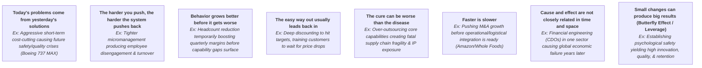

2026-07-31 12:47

Tags:

# Senge's Laws of Systems Thinking

In _The Fifth Discipline_, Senge outlines core systemic laws that govern organizational behavior:

```mermaid
graph TD
    L1["<b>Today's problems come from yesterday's solutions</b><br><i>Ex: Aggressive short-term cost-cutting causing future safety/quality crises (Boeing 737 MAX)</i>"]
    L2["<b>The harder you push, the harder the system pushes back</b><br><i>Ex: Tighter micromanagement producing employee disengagement & turnover</i>"]
    L3["<b>Behavior grows better before it gets worse</b><br><i>Ex: Headcount reduction temporarily boosting quarterly margins before capability gaps surface</i>"]
    L4["<b>The easy way out usually leads back in</b><br><i>Ex: Deep discounting to hit targets, training customers to wait for price drops</i>"]
    L5["<b>The cure can be worse than the disease</b><br><i>Ex: Over-outsourcing core capabilities creating fatal supply chain fragility & IP exposure</i>"]
    L6["<b>Faster is slower</b><br><i>Ex: Pushing M&A growth before operational/logistical integration is ready (Amazon/Whole Foods)</i>"]
    L7["<b>Cause and effect are not closely related in time and space</b><br><i>Ex: Financial engineering (CDOs) in one sector causing global economic failure years later</i>"]
    L8["<b>Small changes can produce big results (Butterfly Effect / Leverage)</b><br><i>Ex: Establishing psychological safety yielding high innovation, quality, & retention</i>"]
```
