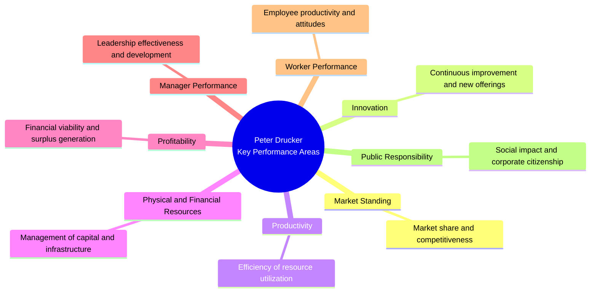

2026-06-15 08:09

Tags:

# Setting Objective

```mermaid

mindmap
  root((Peter Drucker<br/>Key Performance Areas))
    Market Standing
      ::icon(fa fa-chart-line)
      Market share and competitiveness
    Innovation
      ::icon(fa fa-lightbulb)
      Continuous improvement and new offerings
    Productivity
      ::icon(fa fa-tachometer-alt)
      Efficiency of resource utilization
    Physical and Financial Resources
      ::icon(fa fa-money-bill-wave)
      Management of capital and infrastructure
    Profitability
      ::icon(fa fa-hand-holding-usd)
      Financial viability and surplus generation
    Manager Performance
      ::icon(fa fa-user-tie)
      Leadership effectiveness and development
    Worker Performance
      ::icon(fa fa-users)
      Employee productivity and attitudes
    Public Responsibility
      ::icon(fa fa-globe)
      Social impact and corporate citizenship

```
