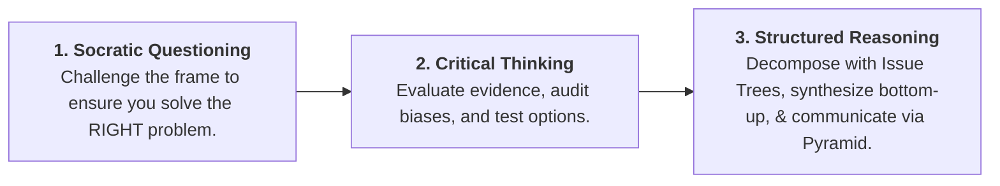

2026-07-28 13:43

Tags:

# Integrated Thinking Frameworks Table

|**Feature**|**Socratic Questioning**|**Critical Thinking (CT)**|**Structured Critical Reasoning (SCR)**|
|---|---|---|---|
|**Origins**|Ancient Greece (Socrates)|Dewey, Kahneman & Tversky|Toulmin, Minto (McKinsey)|
|**Primary Mode**|Dialogic (Group conversation)|Individual reflection + Team culture|Formal structured argumentation & docs|
|**Core Tools**|6 Types of Socratic Questions|Bias audits & evidence evaluation|MECE Issue Trees & Toulmin Model|
|**Time Required**|30–60 minutes|45–90 minutes|2–8 hours|
|**Primary Output**|Reframed problem statement|Decision with bias audit & memo|Recommendation with full logical chain|
|**Corporate Example**|Amazon _Working Backwards_|Watson-Glaser / Decision Memos|Minto Pyramid / Consulting Decks|

To maximize managerial rigor, integrate all three frameworks in sequence:

