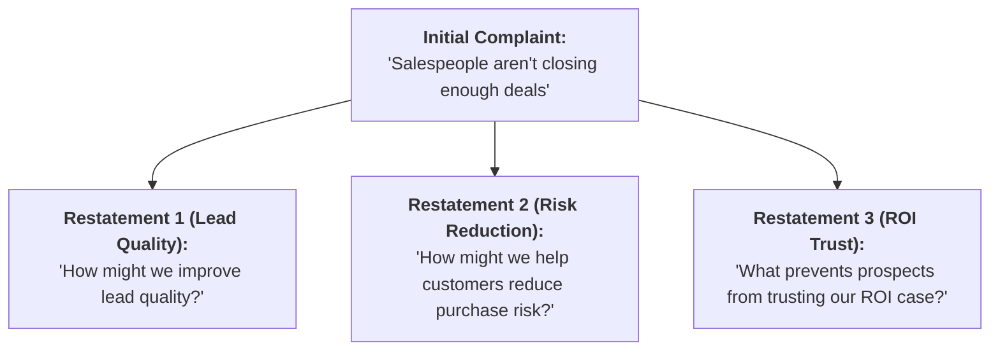

2026-07-28 14:02

Tags:

# Statement or Restatement

- **Origin & Concept:** Rooted in Alex Osborn’s models and William Gordon’s _Synectics_. The wording of a problem dictates the solution space available.
    
- **Core Mechanism:** Forces teams to generate 5–8 alternative problem statements before seeking solutions to avoid solving the wrong problem or treating surface-level complaints.

- **Core Restatement Formats:**
    
    - **Verb + Object:** _"How might we make customers feel heard?"_
        
    - **Reverse / Inversion:** _"How would we guarantee customers leave dissatisfied?"_ (Inverting dissatisfiers isolates satisfiers).
        
    - **Cross-Industry Analogy:** _"How does a hospital manage patient flow?"_ (Applied to retail traffic).

