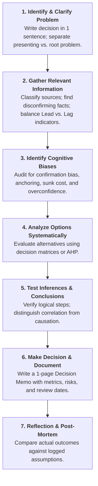

2026-07-24 07:39

Tags:

# Step-by-Step Critical Thinking Workflow (7 Steps)

```mermaid
graph TD
    S1["<b>1. Identify & Clarify Problem</b><br>Write decision in 1 sentence; separate presenting vs. root problem."] --> S2["<b>2. Gather Relevant Information</b><br>Classify sources; find disconfirming facts; balance Lead vs. Lag indicators."]
    S2 --> S3["<b>3. Identify Cognitive Biases</b><br>Audit for confirmation bias, anchoring, sunk cost, and overconfidence."]
    S3 --> S4["<b>4. Analyze Options Systematically</b><br>Evaluate alternatives using decision matrices or AHP."]
    S4 --> S5["<b>5. Test Inferences & Conclusions</b><br>Verify logical steps; distinguish correlation from causation."]
    S5 --> S6["<b>6. Make Decision & Document</b><br>Write a 1-page Decision Memo with metrics, risks, and review dates."]
    S6 --> S7["<b>7. Reflection & Post-Mortem</b><br>Compare actual outcomes against logged assumptions."]
```
