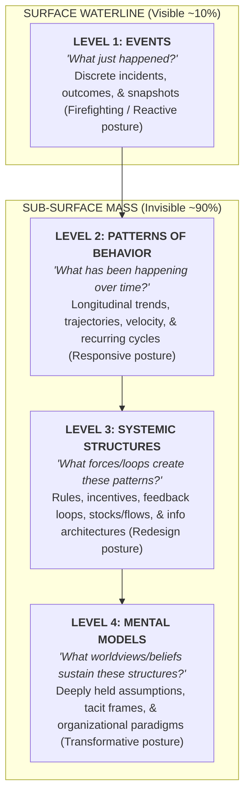

2026-07-31 12:25

Tags:

# System Iceberg

The **Systems Iceberg Model** (also termed the _Systems Pyramid_) is a foundational conceptual framework in system dynamics, conceived at MIT’s Sloan School of Management and popularized by Michael Goodman, Daniel Kim, and Peter Senge.

It uses a visual metaphor to demonstrate that the vast majority of systemic complexity and root causes (~90%) lie invisible beneath the surface level of daily events.

