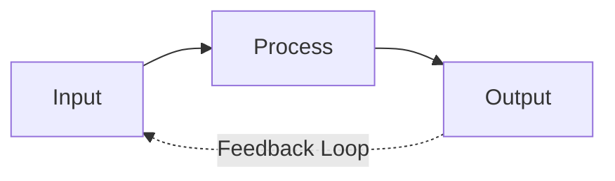

2026-06-22 07:57

Tags:

# System Theory

- **System:** A set of interrelated and interdependent parts arranged in a manner that produces a unified whole
    
- **Closed systems:** Systems that are not influenced by and do not interact with their environment
    
- **Open systems:** The organization is an open system interacting with its environment. All parts are interdependent; change in one affects all.

Application
Supply Change 
ERP system 
Organizational Design 
