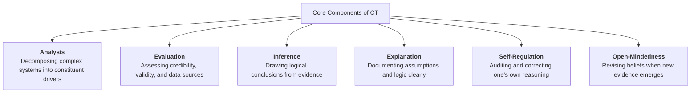

2026-07-24 07:37

Tags:

# The 6 Core Components of Critical Thinking

- **Analysis:** Decomposing complex problems into constituent drivers (e.g., breaking P&L variations down into price, volume, and product mix effects).
    
- **Evaluation:** Assessing the validity and credibility of claims (e.g., distinguishing primary empirical research from analyst speculation).
    
- **Inference:** Extracting logical conclusions from leading indicators (e.g., inferring future revenue churn from Net Promoter Score trends).
    
- **Explanation:** Articulating underlying assumptions and logic transparently (e.g., publishing structured decision memos).
    
- **Self-Regulation:** Auditing and self-correcting one's reasoning to prevent internal cognitive biases.
    
- **Open-Mindedness:** Reinterpreting strategy and abandoning sunk costs when disconfirming facts emerge.