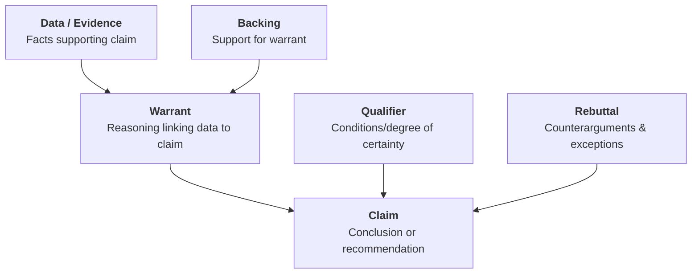

2026-07-25 14:32

Tags:

# The Toulmin Model of Argumentation

- **Claim:** The conclusion or recommendation being proposed (_e.g., "We should enter the Southeast Asian market in Q3 2026"_).
    
- **Data:** Facts, empirical evidence, or observations supporting the claim (_e.g., "Southeast Asia has a $4.2B TAM growing at 18% CAGR"_).
    
- **Warrant:** The underlying logic connecting the data to the claim (_e.g., "Markets growing above 15% CAGR with low penetration yield our highest expansion returns"_).
    
- **Backing:** Evidence that reinforces the validity of the warrant (_e.g., "Our last 3 market entries with similar growth rates delivered an average IRR of 34%"_).
    
- **Qualifier:** Statements expressing the degree of certainty or specific conditions required (_e.g., "Subject to localized supply chain setup within 9 months"_).
    
- **Rebuttal:** Explicit recognition of exceptions or counterarguments where the claim fails (_e.g., "If a major competitor preemptively launches a price war, expected ROI drops significantly"_).