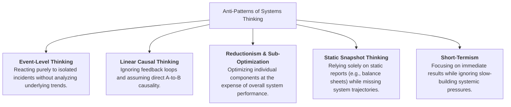

2026-07-30 14:51

Tags:

# What Systems Thinking Is NOT

```mermaid

graph TD
    Root["Anti-Patterns of Systems Thinking"] --> AP1["<b>Event-Level Thinking</b><br>Reacting purely to isolated incidents without analyzing underlying trends."]
    Root --> AP2["<b>Linear Causal Thinking</b><br>Ignoring feedback loops and assuming direct A-to-B causality."]
    Root --> AP3["<b>Reductionism & Sub-Optimization</b><br>Optimizing individual components at the expense of overall system performance."]
    Root --> AP4["<b>Static Snapshot Thinking</b><br>Relying solely on static reports (e.g., balance sheets) while missing system trajectories."]
    Root --> AP5["<b>Short-Termism</b><br>Focusing on immediate results while ignoring slow-building systemic pressures."]
    
```
